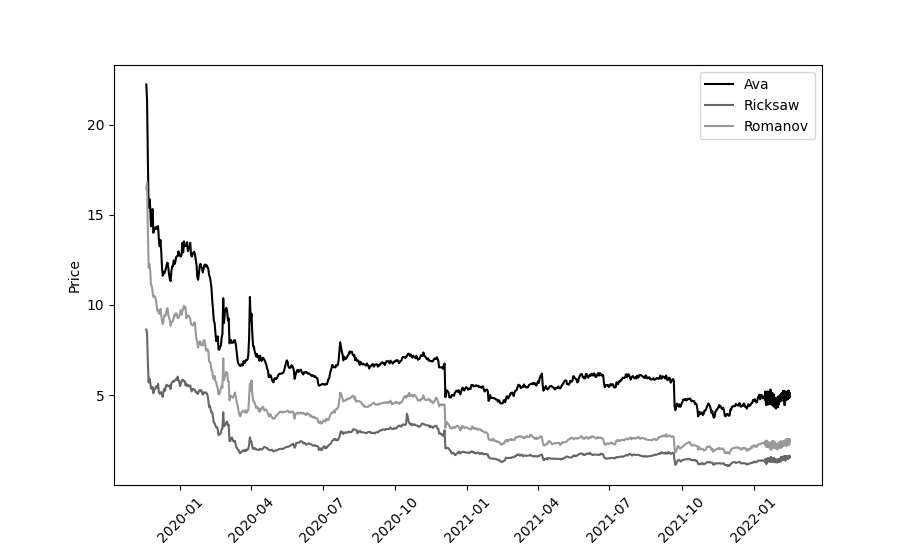

# Steam Market Visualisation
It's a simple script that uses request library to get json file form unofficial SteamAPI,after that json is passed and graph is plotted.

      

>You need to add your own "steamLoginSecure" key to code. First login to Steam in your browser of choice then open developer options(F12) and in Storage locate "steamLoginSecure" then copy the string to code.